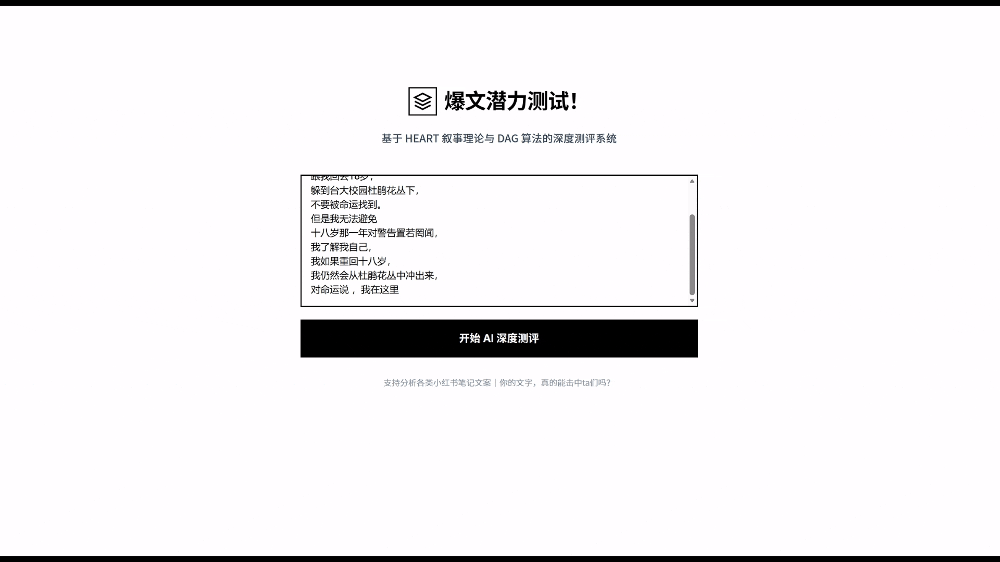
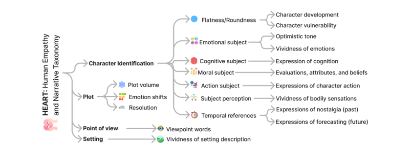

# 🔥 测试你的爆文潜力！

**你的文字，真的能击中 ta 们吗？**

> 基于HEART叙事理论的小红书文案共情力深度测评系统

<p align="center">
  <a href="https://heart-frontend-h2yw.onrender.com/" target="_blank">
    
  </a>
</p>

<p align="center">
  
  &nbsp;
  
</p>


## 项目灵感

我们分析了大量社交媒体爆款内容后发现：**热度高的文章，文案几乎都能强烈触动读者情感**。它们不一定辞藻华丽，但往往有一种神奇的力量——让读者觉得"这说的就是我"。

这背后的秘密，是**共情力**。


## 理论基础：HEART 叙事框架

> 论文：[*HEART: Human Empathy and Narrative Taxonomy*](https://arxiv.org/abs/2405.17633)（arXiv 2405.17633）

这篇论文系统研究了**叙事风格（Narrative Style）如何通过文本特征激发读者共情**，并提出了一套名为 **HEART**（Human Empathy and Narrative Taxonomy）的分类框架，将引发共情的叙事元素拆解为可量化的维度体系。

<p align="center">
  
</p>

HEART 框架从四个叙事层面分析文本：

| 叙事层面 | 核心要素 |
|---------|---------|
| **角色识别**（Character Identification） | 角色的扁平/圆形塑造、情感主体、认知表述、道德判断、行动表现 |
| **情节**（Plot） | 情节体量、情绪转变、矛盾解决 |
| **视角**（Point of View） | 视角词汇使用方式 |
| **场景**（Setting） | 环境描写的生动程度 |

本系统从 HEART 框架中提炼出 **9 个核心评分维度**，通过 LLM 对文本进行打分，量化其共情潜力。


## 评分体系

### 9 个维度与权重

| 维度 | 权重 | 可选分值 |
|------|------|----------|
| 情感生动性 | **50%** | 2 / 6 / 10 |
| 环境生动性 | 15% | 2 / 6 / 10 |
| 角色脆弱性 | 10% | 2 / 6 / 10 |
| 认知表述丰富度 | 8% | 2 / 6 / 10 |
| 语气情绪 | 5% | 2 / 4 / 6 / 8 / 10 |
| 情节体量 | 4% | 2 / 4 / 6 / 8 / 10 |
| 矛盾解决程度 | 3% | 2 / 4 / 6 / 8 / 10 |
| 角色发展程度 | 3% | 2 / 4 / 6 / 8 / 10 |
| 情绪转变程度 | 2% | 2 / 4 / 6 / 8 / 10 |

### 加权公式

```
总分 = 0.50×情感生动性 + 0.15×环境生动性 + 0.10×角色脆弱性
     + 0.08×认知表述丰富度 + 0.05×语气情绪 + 0.04×情节体量
     + 0.03×矛盾解决程度 + 0.03×角色发展程度 + 0.02×情绪转变程度
```


### 技术栈

**后端**

| 组件 | 技术 |
|------|------|
| Web 框架 | FastAPI 0.115 + Uvicorn |
| 数据校验 | Pydantic 2.10 |
| LLM 客户端 | OpenAI SDK / httpx（Gemini、DeepSeek） |
| ML 校准 | scikit-learn（等渗回归）、pandas、numpy |
| JSON 容错 | json5 |
| 测试 | pytest + pytest-asyncio |
| Python 版本 | 3.11.0 |

**前端**

| 组件 | 技术 |
|------|------|
| 框架 | Next.js 16 + React 19 |
| UI 组件库 | Radix UI |
| 图表 | Recharts 2 |
| 样式 | Tailwind CSS 4 |
| 表单 | React Hook Form + Zod |


## 目录结构

```
feishu-main/
├── docs/                           # 文档图片资源
│   ├── input.gif                   # 输入页面演示
│   ├── output.gif                  # 结果页面演示
│   └── heartheory.png              # HEART 理论框架图
└── heart/
    ├── backend/                    # FastAPI 后端
    │   ├── main.py                 # 应用入口
    │   ├── api/                    # 路由与中间件
    │   ├── config/                 # 环境变量配置
    │   ├── models/                 # Pydantic Schema
    │   ├── services/               # 评分流程、LLM 服务、Prompt 模板
    │   ├── utils/                  # 计算器、JSON 解析器
    │   ├── calibration/            # ML 校准层
    │   └── tests/                  # 单元测试与集成测试
    ├── XHS-Analyzer-Demo/          # Next.js 前端
    ├── render.yaml                 # Render.com 部署配置
    └── start.sh                    # 后端启动脚本
```


## 快速开始

### 前置要求

- Python 3.11.0
- Node.js 18+
- 至少一个 LLM 的 API Key（DeepSeek / OpenAI / Gemini）

### 1. 启动后端

```bash
cd heart/backend

# 安装依赖
pip install -r requirements.txt

# 配置环境变量
cp .env.example .env
# 编辑 .env，填写你的 API Key

# 启动
uvicorn main:app --reload --port 8000
```

访问 `http://localhost:8000/docs` 查看 Swagger 接口文档。

### 2. 启动前端

```bash
cd heart/XHS-Analyzer-Demo

npm install
npm run dev
```

访问 `http://localhost:3000` 开始测评。


## 环境变量配置

在 `heart/backend/.env` 中配置评分模型

前端自定义后端地址（可选）：

```env
# heart/XHS-Analyzer-Demo/.env.local
NEXT_PUBLIC_API_URL=http://localhost:8000
```


## 部署到 Render.com

项目提供 `heart/render.yaml`，一个配置文件同时部署前后端。

1. 将代码推送到 GitHub
2. 在 Render 控制台选择 **New Blueprint** 并关联仓库
3. Render 自动识别配置，创建前后端两个 Web Service
4. 在后端服务的环境变量中手动填写 `DEEPSEEK_API_KEY`
5. 前端 `NEXT_PUBLIC_API_URL` 自动注入后端地址，无需手动配置


## ML 校准层

如果你有人工标注数据集，可以训练等渗回归模型来对齐 LLM 的打分分布（本项目已使用论文人工打分的数据集来矫正模型打分）：

```bash
cd heart/backend

# 第一步：用 LLM 对标注数据集批量打分
python calibration/batch_score.py --csv <数据集.csv>

# 第二步：训练校准模型
python calibration/trainer.py --csv <数据集.csv>
# 生成 calibration/artifacts/calibrators.pkl
```

`calibrators.pkl` 存在时自动生效；不存在时直接使用 LLM 原始分数，不影响系统正常运行。


## 测试

```bash
cd heart/backend

pytest tests/ -v                        # 运行全部测试
pytest tests/test_calculator.py -v      # 计算器单元测试
pytest tests/test_parser.py -v          # JSON 解析器单元测试
pytest tests/test_api.py -v             # API 集成测试（Mock LLM，无需真实 Key）
```

## 后续开发目标
-LLM裁判易对环境描述、人类认知描述产生误判。需引入机器学习等更复杂的方法训练模型
-共情还关系读者自身的共情能力，相似经历与文化背景等。需描绘用户画像。根据用户特征动态调整评分标准
-落实到社交媒体等应用场景。利用打分系统对真实文案进行文本热度预测

## 参考论文

> Minh-Chau Nguyen et al. *HEART: Human Empathy and Narrative Taxonomy — Modeling Narrative Style to Evoke Empathy in Readers.*
> arXiv preprint [arXiv:2405.17633](https://arxiv.org/abs/2405.17633), 2024.
