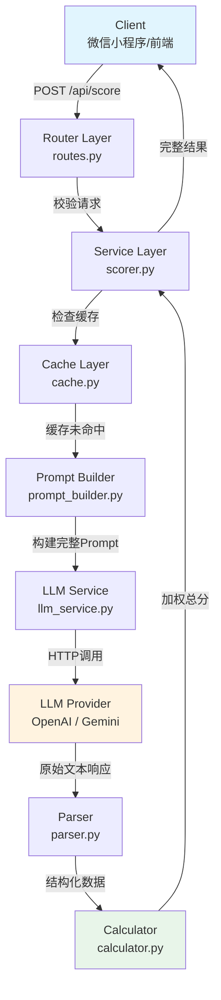

## Product Overview

一款基于 HEART 评估框架的文本共情力评分后端服务。用户提交待评估文本，系统通过 LLM 从 9 个维度进行量化打分，并按加权公式计算最终共情度分数，返回结构化评分结果与综合评价。该产品面向 AI 文本分析场景，可被微信小程序等前端调用。

## Core Features

- **文本接收与校验**：API 接收用户提交的待评论文本，进行长度、格式等前置校验
- **9 维度 LLM 评分**：调用大语言模型，按 HEART 框架对文本进行 9 个维度的量化评分（情感生动性、环境生动性、角色脆弱性、认知表述丰富度、语气情绪、情节体量、矛盾解决程度、角色发展程度、情绪转变程度）
- **加权总分计算**：按指定权重公式（情感生动性 0.50 + 环境生动性 0.15 + 角色脆弱性 0.10 + 认知表述丰富度 0.08 + 语气情绪 0.05 + 情节体量 0.04 + 矛盾解决程度 0.03 + 角色发展程度 0.03 + 情绪转变程度 0.02）计算 (0, 10] 区间内的最终共情度分数
- **结构化结果返回**：返回各维度得分及判定理由、公式计算过程、综合评价
- **LLM 输出解析与容错**：对 LLM 返回的非结构化/半结构化文本进行 JSON 解析，处理格式异常情况

### 对 GPT 给出的框架评审结论

GPT 提供的目录结构整体**合理且专业**，采用分层架构符合 FastAPI 最佳实践。以下是需要优化和补充的关键点：

1. **缺少 `requirements.txt` / `pyproject.toml`**：依赖管理文件缺失
2. **缺少 `.env` / `.env.example`**：环境变量管理缺失
3. **`llm_service.py` 需支持多 LLM 后端**：应兼容 OpenAI API 格式（便于切换不同 LLM 提供商），而非绑定单一 SDK
4. **`parser.py` 是核心难点**：LLM 返回的 JSON 极易出现格式错误（如 markdown 包裹、字段缺失、类型错误），需要多层容错策略
5. **缺少中间件层**：请求限流、日志、错误处理中间件
6. **`cache.py` 建议升级为必选项**：相同文本重复评分场景下缓存能显著降低成本和延迟
7. **缺少 `tests/` 目录**：单元测试和集成测试缺失

## Tech Stack

- **后端框架**：Python 3.11+ / FastAPI（高性能异步 Web 框架，原生支持 async/await）
- **LLM 调用**：httpx（异步 HTTP 客户端）+ OpenAI 官方 SDK + Google Generative AI SDK（支持 OpenAI GPT 系列、Google Gemini 系列双提供商）
- **数据验证**：Pydantic v2（请求/响应模型定义与校验）
- **配置管理**：python-dotenv + pydantic-settings（环境变量管理）
- **JSON 解析**：正则提取 + json5（容错解析 LLM 非标准 JSON 输出）
- **缓存**：内存缓存（dict-based TTL Cache），可选 Redis 扩展
- **日志**：structlog（结构化日志，便于调试与运维）
- **依赖管理**：uv / pip + requirements.txt

## Implementation Approach

采用**分层架构**（Controller -> Service -> LLM -> Parser -> Calculator），核心策略如下：

1. **LLM 调用层双提供商支持**：通过抽象接口统一 OpenAI（官方 SDK）和 Gemini（Google Generative AI SDK）两种调用方式，使用配置 `provider` 字段切换，httpx 作为底层异步传输层
2. **Prompt 工程 + 输出格式约束**：在 System Prompt 中严格要求 LLM 以 JSON 格式输出，并通过 few-shot 示例引导输出格式；同时在 Prompt 中嵌入 JSON Schema 引导
3. **三层容错解析策略**：第一层尝试标准 json.loads；第二层用正则从 markdown 代码块中提取 JSON；第三层用 json5 容错解析（允许尾逗号、注释等）；第四层作为降级方案，用正则逐字段提取得分
4. **加权计算器独立为纯函数模块**：无副作用，便于单元测试
5. **内存缓存基于文本 hash**：对相同输入文本做 SHA256 哈希作为 cache key，设置合理 TTL（如 24h），避免重复 LLM 调用

### 关键技术决策理由

| 决策 | 理由 |
| --- | --- |
| FastAPI 而非 Flask/Django | 原生异步 + 自动 OpenAPI 文档 + Pydantic 深度集成，适合 LLM 调用的 I/O 密集型场景 |
| OpenAI + Gemini 双 SDK | 用户明确要求仅支持 OpenAI 和 Gemini 两个提供商，使用各自官方 SDK 确保最佳兼容性与功能支持 |
| httpx 而非 requests | 原生 async/await 支持，与 FastAPI 的异步架构完美配合 |
| json5 容错解析 | LLM 生成的 JSON 经常出现非标准格式（尾逗号、单引号等），json5 能处理绝大多数情况 |


## Architecture Design

系统采用经典的四层分层架构，数据流清晰单向：



## Implementation Notes

- **性能瓶颈在 LLM 调用**：单次评分预计 3-15 秒，需合理设置 httpx timeout（建议 60s），前端应有 loading 状态
- **LLM 输出不稳定是最大风险**：parser 必须做到四层降级，确保即使 LLM 输出不规范也能提取到 9 个维度的分数
- **权重之和 = 1.00**（0.50+0.15+0.10+0.08+0.05+0.04+0.03+0.03+0.02），理论满分 10 分，需在校验器中约束各维度分数范围为合法值
- **API Key 安全**：严禁将 API Key 提交到 Git 仓库，使用 .env 文件 + .gitignore 管理
- **日志脱敏**：记录请求日志时截断过长的文本内容（>500 字符），避免泄露用户隐私
- **请求限流**：建议对同一 IP/用户实施速率限制（如 10 次/分钟），防止 LLM 调用成本失控

## Directory Structure

```
c:/Users/27666/Desktop/heart/
├── backend/
│   ├── main.py                     # [NEW] FastAPI 应用入口，创建 App 实例、注册路由、启动配置、生命周期管理
│   ├── api/
│   │   ├── __init__.py             # [NEW] API 包初始化
│   │   ├── routes.py               # [NEW] API 路由层，定义 POST /api/score 评分接口，请求校验与响应封装
│   │   └── dependencies.py         # [NEW] 公共依赖注入（请求限流、日志中间件、错误处理器）
│   ├── services/
│   │   ├── __init__.py             # [NEW] Services 包初始化
│   │   ├── scorer.py               # [NEW] 评分主流程编排器，协调 prompt 构建 -> LLM 调用 -> 解析 -> 计算的全流程
│   │   ├── llm_service.py          # [NEW] LLM 调用封装（核心），抽象接口支持 OpenAI（官方SDK）与 Gemini（Google GenAI SDK）双提供商切换
│   │   └── prompt_builder.py       # [NEW] Prompt 构建器，组装 HEART 评估框架的 System Prompt + User Prompt + Output Format 引导
│   ├── models/
│   │   ├── __init__.py             # [NEW] Models 包初始化
│   │   └── schema.py               # [NEW] Pydantic 数据模型定义（请求体 ScoreRequest、响应 ScoreResponse、维度分 DimensionScore 等）
│   ├── utils/
│   │   ├── __init__.py             # [NEW] Utils 包初始化
│   │   ├── parser.py               # [NEW] LLM 输出 JSON 解析器（关键难点），四层容错策略：标准JSON -> 正则提取 -> json5 -> 正则逐字段降级
│   │   ├── calculator.py           # [NEW] 加权计算纯函数模块，接收 9 维度分数返回加权总分与计算过程
│   │   └── cache.py                # [NEW] 内存 TTL 缓存管理器，基于文本 SHA256 哈希的键值缓存，支持过期与容量限制
│   ├── config/
│   ├── __init__.py                 # [NEW] Config 包初始化
│   └── settings.py                 # [NEW] 配置中心，使用 pydantic-settings 管理 LLM Provider 选择（openai/gemini）、API Key、模型名、超时、缓存 TTL 等
├── tests/                          # [NEW] 测试目录
│   ├── __init__.py
│   ├── test_calculator.py          # [NEW] 加权计算器单元测试（边界值、正常值、非法值）
│   ├── test_parser.py              # [NEW] JSON 解析器单元测试（标准格式、markdown包裹、非标准JSON、降级场景）
│   ├── test_scorer.py              # [NEW] 评分流程集成测试（Mock LLM 响应）
│   └── test_api.py                 # [NEW] API 接口测试（FastAPI TestClient）
├── requirements.txt                # [NEW] Python 依赖清单
├── .env.example                    # [NEW] 环境变量示例模板（不含真实密钥）
├── .gitignore                      # [NEW] Git 忽略规则（.env, __pycache__, *.pyc 等）
└── README.md                       # [NEW] 项目说明文档
```

## Key Code Structures

### 核心 Pydantic 模型（models/schema.py）

```python
# 维度评分结果
class DimensionScore(BaseModel):
    name: str                          # 维度名称（中文）
    key: str                           # 维度标识（英文 key）
    score: float                       # 得分
    reason: str                        # 判定理由

# 评分请求
class ScoreRequest(BaseModel):
    text: str = Field(..., min_length=10, max_length=10000)

# 评分响应
class ScoreResponse(BaseModel):
    success: bool
    dimensions: list[DimensionScore]    # 9 个维度评分
    total_score: float                 # 加权共情度分数 (0, 10]
    calculation_process: str           # 公式计算过程展示
    evaluation: str                    # 综合评价
    model_used: str                    # 使用的 LLM 模型名称
```

## Agent Extensions

### SubAgent

- **code-explorer**
- Purpose: 在实现过程中探索项目代码结构、追踪模块间依赖关系、验证代码一致性
- Expected outcome: 确保所有新增文件的导入路径正确、模块引用无误、代码风格统一